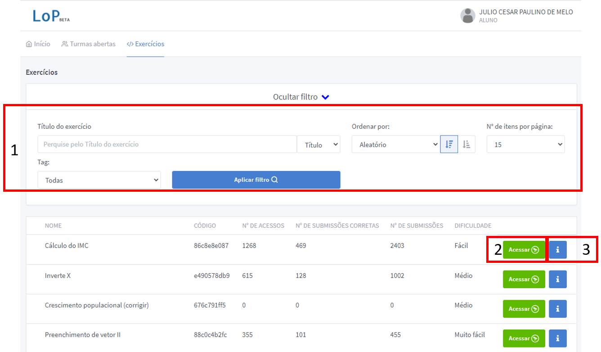
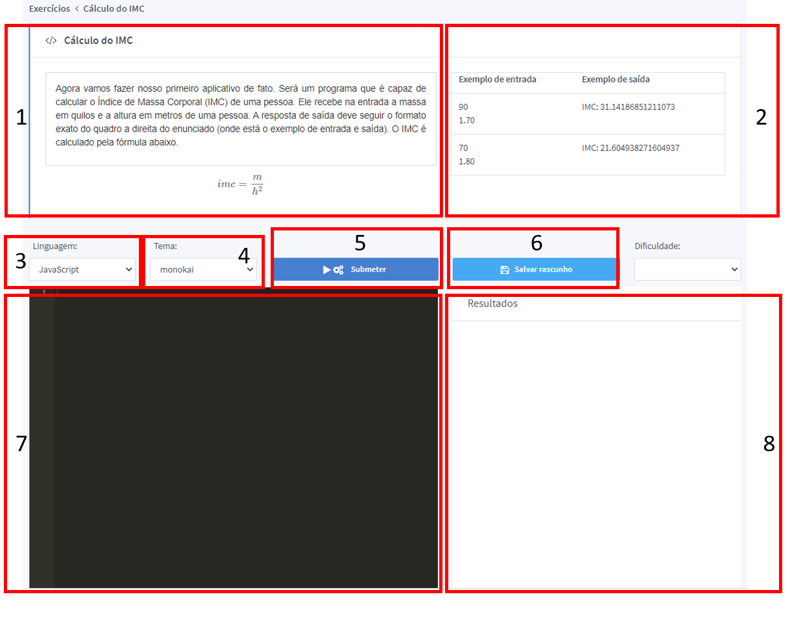
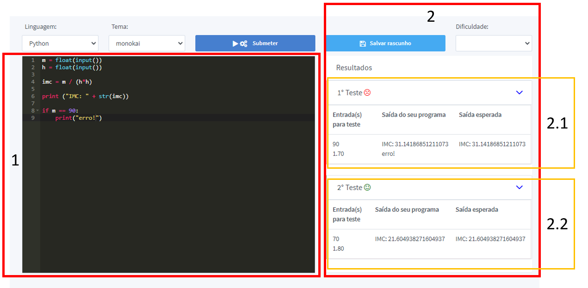
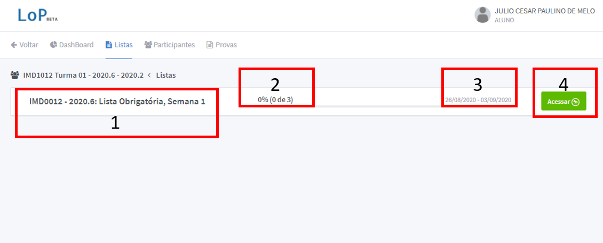
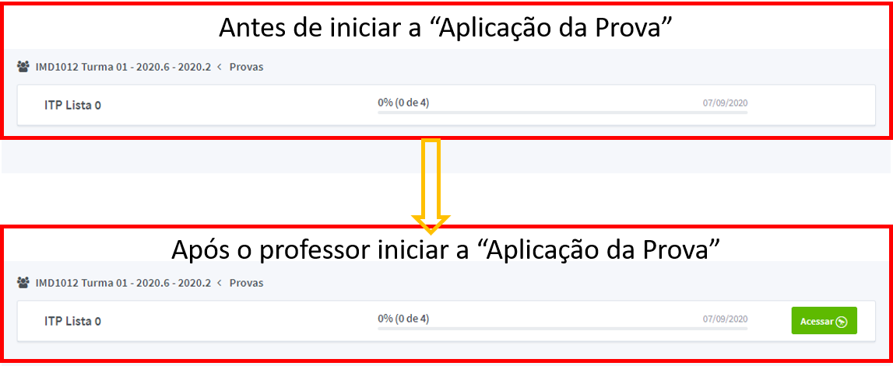

# Alunos

Para se cadastrar no sistema acesse o site lop.natalnet.br e realize o cadastro a partir da tela de login do sistema. __Por Favor__ registre seu nome completo como aparece nas listas de chamada do sistema acadêmico, a fim de facilitar o processo de correção dos exercícios pelo professor.

## Entrado em uma Turma

Para entrar em uma turma, após fazer o cadastro e entrar com sua conta de aluno, de mãos do código da turma que foi fornecido pelo professor siga os passos do vídeo abaixo:

<video controls>
    <source src="vid/lop_entrar_turma.mp4" type="video/mp4">
    Como entrar em uma turma / Sem vídeo
</video>

Preencha corretamente sua matrícula para ajudar o professor nas etapas avaliativas.

## Resolvendo um exercício avulso

Após entrar no sistema você pode resolver exercícios avulsos sem compromisso algum com disciplinas. Na tela inicial, clique no botão "Exercícios" na parte superior para acessar a lista de exercícios cadastrados no sistema.



Nesta tela você tem inicialmente uma opção de "Exibir Filtro", na figura acima, esta opção foi clicada para exibir as opções de filtragem de questão(1); é possível também visualizar uma questão(3), que mostra o enunciado da mesma, ou acessá-la(2). Usando o botão "Acessar" em uma questão específica, irá levá-lo para a tela que permite a resolução do exercício.



Na tela resolução de exercício múltiplos campos são exibidos:

1. __Enunciado da questão__ junto com todas as informações que você precisa interpretar para resolvê-la.
2. __Exemplos de entrada e saída__: No lop, o seu programa é executado junto com um conjunto de entradas a fim de produzir uma saída específia. No caso da imagem, o programa irá ser executado e receber do usuário os números 90 e 1.70, depois disso o programa deve imprimir: "IMC: 31.14186851211073".
3. __Caixa de seleção da linguagem__: Enquanto resolve questões avulsas, você pode usar qualquer linguagem suportada pelo sistema para submeter a solução, selecione a linguagem que quiser treinar.
4. __Tema do editor de texto__: Você pode selecionar um tema que fique melhor para você editar/ver o código.
5. __Submeter questão__: Quando tiver um código que você acha que funciona para o problema, você pode submetê-lo para correção. O sistema irá executar o código e mostrar o resultado da correção na tela ao lado. Uma solução pode ser submetida quantas vezes você quiser.
6. __Salvar Rascunho__: Um rascunho da questão é salvo no seu navegador para que você possa continuar depois.
7. __Resultados da Execução__: Ao submeter uma questão para correção os resultados são exibidos nesta tela.

A caixa que fala "Dificuldade" é reservada para uma funtura função do LoP, mas ainda não está implementada, você pode ignorar esta caixa de seleção. Usando a tela mostrada, é possível submeter questões ao sistema para verificação da corretude. Quando uma questão dá um resultado errado, o sistema exibirá qual foi a entrada fornecida e qual foi o resultado obtido da execução.



Quando uma solução é submetida o sistema realiza os testes especificados pelo professor e exibe para você quais resultados o seu programa produziu e quais eram os resultados esperados. No caso mostrado na figura àcima, o primeiro teste(2.1) falhou pois a saída o do programa:

```
IMC: 31.14186851211073
erro!
```
Foi diferente da saída esperada pelo sistema ```IMC: 31.14186851211073```. Já para o segundo caso de teste(2.2) o programa forneceu a saída esperada corretamente.

## Resolvendo uma lista de exercícios

Listas de exercícios são cadastrada pelo professor responsável por uma dada turma, para acessar as listas que o seu professor cadastrou na sua turma, de pois de realizar login, na tela inicial entre na turma usando o botão "Entrar". Nessa tela, acesse na parte superior o menu "Listas", se o professor tiver cadastrado alguma lista ela aparecerá na tela que segue.



Nesta tela você tem informações a respeito do Nome da Lista(1); Seu progresso na mesma (2); A data de inicio e de entrega da lista (3) e, por fim você pode "Acessar"(4) a lista para entrar na tela de resolução.

Na tela de resolução você tem acesso às questões da lista e pode acessá-las para entrar em uma tela similar à tela de resolução de Exercícios, já explicada anteriormente.

## Resolvendo uma prova

Da mesma forma a resolução de listas de exercício, para resolver uma prova você deve logar no sistema, acessar sua turma pelo botão "Entrar" e clicar no botão "Provas" na parte superior. Nesta tela, se o professor tiver cadastrado alguma prova na turma, a prova em questão aparecerá listada, em uma forma similar ao que foi visto para as listas de exercício. No entanto, só é possível acessar uma prova se o professor já estiver "aplicando" a mesma.



A imagem mostra como a prova é listada antes e depois do inicio da "aplicação" da mesma. Diferente das listas de exercício, provas não tem uma data final, a prova é finalizada manualmente pelo professor. Para acessar a prova, use o botão "Acessar" e entre a __senha da prova__ que deve ser fornecida pelo professor. A tela de resolução de questões da prova é similar aquela usada para resolver listas de exercício, bem como os mencanismos de "Acessar" e submeter uma questão permanecem os mesmos. Após a finalização da prova, não é mais possível enviar submissão de resolução de questões para ela.
