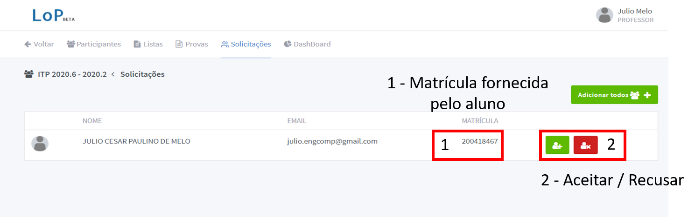
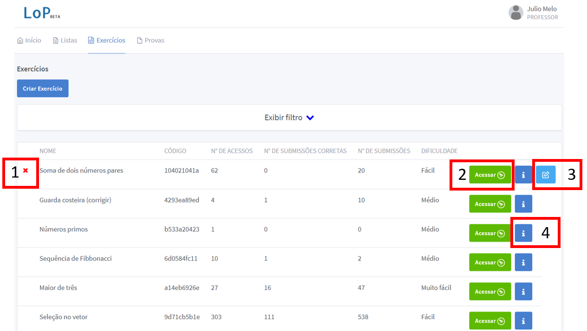
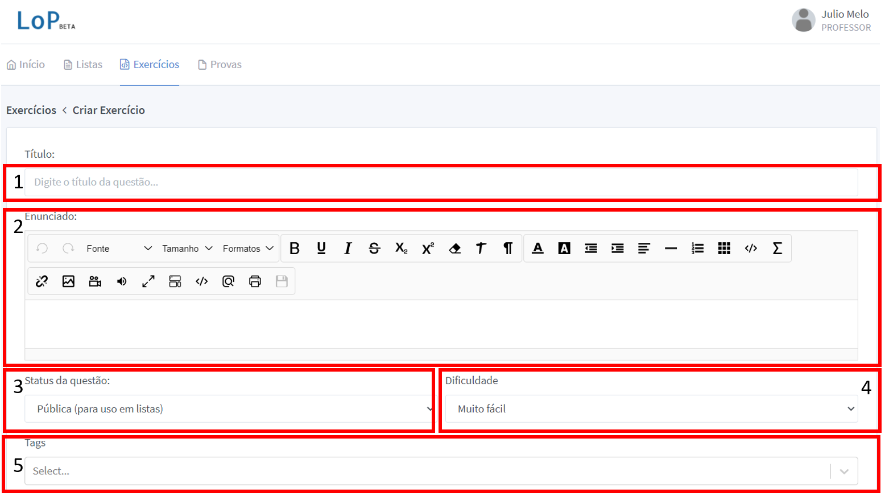
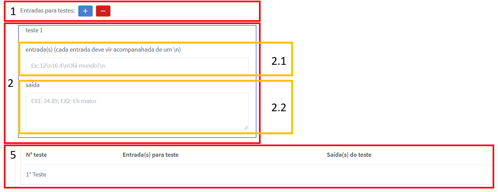
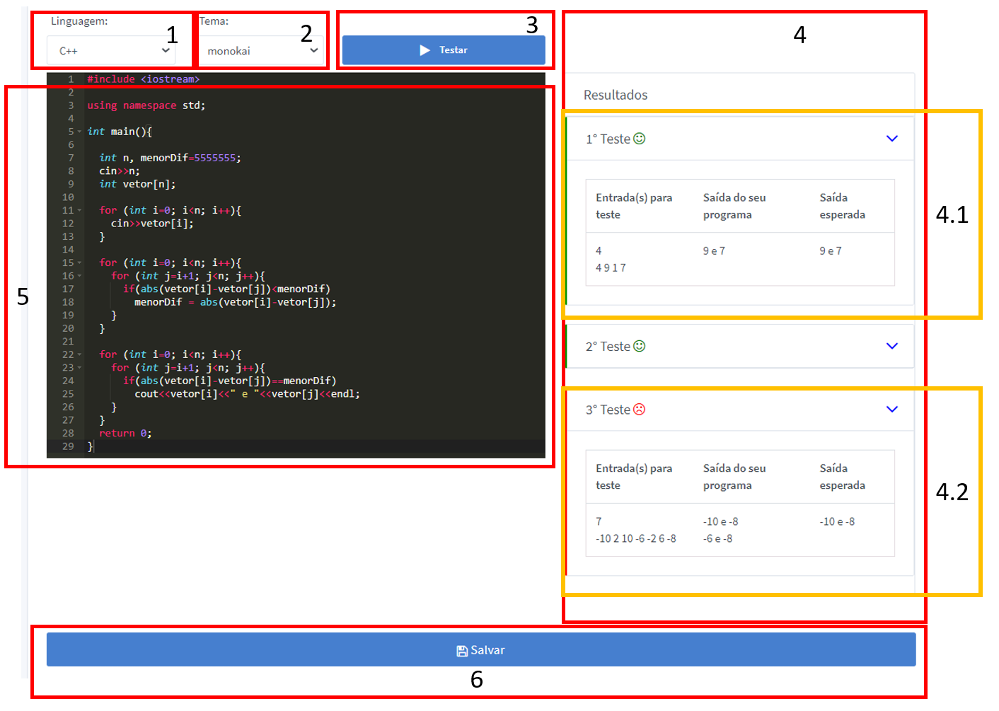

# Professores

## Criando novas turmas

Para criar novas turmas, após logar no sistema com sua conta de professor, siga os passos do video abaixo para criar uma turma:

<video controls>
    <source src="vid/lop_criar_turma.mp4" type="video/mp4">
    Como criar uma turma / Sem vídeo
</video>

No vídeo exemplo atente para o __código__ da turma criada, o valor 8cb8dd2fd3. Cada turma criada no sistema tem um código diferente que deve ser passado aos alunos para que eles possam se registrar na turma.

## Aceitando solicitações dos alunos

Após criada uma turma, um aluno pode solicitar acesso à ela usando o código da turma. Para verificar e aceitar solicitações acesse a turma pelo botão entrar e clique no menu "solicitações" na parte superior. A próxima tela mostrará o conjunto de solicitações feitas, clique no botão "Verde" para cadastrar o aluno naquela turma ou no vermelho para negar a solicitação.

__Atente para a matricula__ dos alunos solicitantes, uma vez que o sistema LoP não é cadastrado junto ao sistema acadêmico, é essencial que a matrícula fornecida pelo aluno esteja correta, negue a entrada de alunos que não forneceram uma matrícula correta.

## Cadastrando Novas Questões

Após logar na conta de professor, clique em "Exercícios", na parte superior. A tela que segue é a lista de questões já cadastradas no sistema, como pode ser visto na figura abaixo.

Nesta tela também é possível remover algum exercício que tenha sido cadastrado por você (1), como editá-lo (3) usando os menus disponíveis. O professor também pode ver (4) ou acessar (2) exercícios cadastrados pelos demais. A diferença entre visuazlizar e acessar é que a vizualização é apenas uma tela resumida do problema, já no menu "Acessar" o professor pode realizar testes para verificar o nível de dificuldade da questão usando o próprio sistema de submissões.

Para criar uma questão clique em "Criar Exercício" na parte superior, para entrar na tela de criação de questões. Nessa tela, várias opções serão exibidas, para facilitar a descrição dividi essa tela em 3 partes

### Parte 1 - Informações básicas do exercício
   

A imagem mostra 4 campos principais:
1. Título: O título da questão à ser exibido na lista de questões vista anteriormente.
2. Enunciado: O enunciado da questão que pode ser incrementado usando uma série de recursos de formatação. A documentação sobre a formatação pode ser encontrada no site do [Sun Editor](http://suneditor.com/sample/index.html). Atualmente o LoP não conta com um armazenamento interno, logo se precisar usar imagens, procure um hoster de imagens gratuito e faça upload das imagens lá ou use um diretório público no google drive e use o "link" da imagem como fonte em um site como o [gdurl](gdurl.com).
3. Status da questão: Se a questão estiver marcada com __Pública (para uso em lista)__ ela aparecerá na lista de questões para que os alunos possam respondê-la a qualquer momento, __esteja ela em uma lista cadastrada para a turma ou não__. Caso seja necessário que a questão não seja visível para os alunos resolverem, use a opção __Oculta (para uso em provas)__, nesse caso a questão só será visível para compor provas.
4. Dificuldade: Uma avaliação pessoal do professor sobre a dificuldade da questão.
5. Tags: Usada para agrupamento de questões.

### Parte 2 - Informações dos Testes do exercício

Nessa parte o professor insere informações relacionadas aos casos de teste da questão. O formato é o mesmo que o usado no [URI](https://www.urionlinejudge.com.br/) e outros sites, onde cada execução do programa deve fornecer uma saída dada uma entrada específica. Os campos dessa parte são:

1. Entradas para testes: Esse campo tem dois botôes, no botâo "+" o professor adiciona um novo caso de teste, no botão "-" o professor remove o último caso de teste adicionado.
2. Esse campo contém as entradas e saídas correspondentes ao caso de teste. O programa será executado recebendo na entrada padrão(stdin) a string passada no campo 2.1, no caso de entradas com mais de uma linha, o professor precisa inserir "\n" para indicar que há quebra de linha correspondente a entrada. A saída do programa, ao receber a entrada, é comparada com o texto fornecido no campo 2.2 a fim de testar a corretude, diferente do campo 2.1, quebras de linha neste campo não precisam ser sinalizadas com "\n". O sistema executa o programa do aluno para todos os casos de teste fornecidos, além disso o sistema mostra ao aluno qual caso de teste causou um erro, caso algum tenha acontecido. O sistema LoP irá sortear alguns casos de teste desta lista para mostrar aos alunos na tela de resolução de exercício.
3. Sumário dos casos de teste, esse campo lista todos os casos de teste no formato "entrada | saída".

### Parte 3 - Teste do Exercício

Nesta parte o professor pode testar o exercicio como se fosse um aluno. É possível escrever código e submeter ao sistema para verificação dos casos de teste. Os elementos da interface são:

1. Linguagem: nesta tela é possível submeter testes a qualquer uma das linguagens suportadas pelo sistema.
2. Tema: É possível escolher um tema para o editor de código
3. Testar: Clicando neste botão o programa será executado e os resultados exibidos no quadro ao lado.
4. Resultados: Sumário dos resultados advindos da execução do programa. Os resultados podem ser corretos como mostrado na parte 4.1 ou errados como na parte 4.2. Em qualquer um dos casos o usuário terá acesso à saída produzida pelo programa, a entrada fornecida e a saída esperada.
5. O código que será submetido e executado. Este código não é mostrado aos alunos que tentarem acessar essa questão.
6. Salva a questão atual com os parâmetros escolhidos.

### Tudo junto

Segue um vídeo mostrando um cadastro de uma questão simples:

# Alunos

# Entrado em uma Turma

Para entrar em uma turma, faça o cadastro no Sistema LoP e entre com sua conta de aluno, de mãos do código da turma que foi fornecido pelo professor siga os passos do vídeo abaixo:

<video controls>
    <source src="vid/lop_entrar_turma.mp4" type="video/mp4">
    Como criar uma turma / Sem vídeo
</video>

Preencha corretamente sua matrícula para ajudar o professor nas etapas avaliativas.