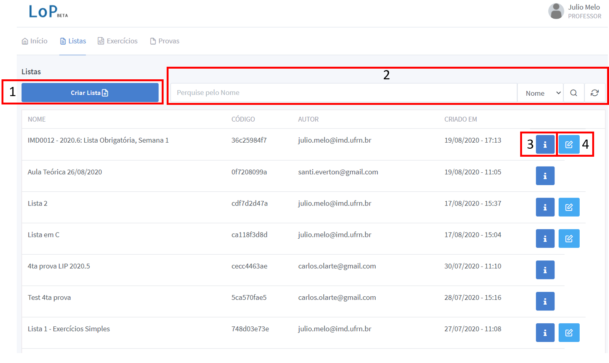

# Professores

Este tutorial cobre as operações básicas no lop que serão necessárias para 2020.6, espero que gostem, qualquer coisa entrem em contato que atualizo o tutorial.

## Criando novas turmas

Para criar novas turmas, após logar no sistema com sua conta de professor, siga os passos do video abaixo para criar uma turma:

<video controls>
    <source src="vid/lop_criar_turma.mp4" type="video/mp4">
    Como criar uma turma / Sem vídeo
</video>

No vídeo exemplo atente para o __código__ da turma criada, o valor 8cb8dd2fd3. Cada turma criada no sistema tem um código diferente que deve ser passado aos alunos para que eles possam se registrar na turma.

## Aceitando solicitações dos alunos

Após criada uma turma, um aluno pode solicitar acesso à ela usando o código da turma. Para verificar e aceitar solicitações acesse a turma pelo botão entrar e clique no menu "solicitações" na parte superior. A próxima tela mostrará o conjunto de solicitações feitas, clique no botão "Verde" para cadastrar o aluno naquela turma ou no vermelho para negar a solicitação.

__Atente para a matricula__ dos alunos solicitantes, uma vez que o sistema LoP não é cadastrado junto ao sistema acadêmico, é essencial que a matrícula fornecida pelo aluno esteja correta, negue a entrada de alunos que não forneceram uma matrícula correta.

## Cadastrando Novas Questões

Após logar na conta de professor, clique em "Exercícios", na parte superior. A tela que segue é a lista de questões já cadastradas no sistema, como pode ser visto na figura abaixo.

Nesta tela também é possível remover algum exercício que tenha sido cadastrado por você (1), como editá-lo (3) usando os menus disponíveis. O professor também pode ver (4) ou acessar (2) exercícios cadastrados pelos demais. A diferença entre visuazlizar e acessar é que a vizualização é apenas uma tela resumida do problema, já no menu "Acessar" o professor pode realizar testes para verificar o nível de dificuldade da questão usando o próprio sistema de submissões.

Para criar uma questão clique em "Criar Exercício" na parte superior, para entrar na tela de criação de questões. Nessa tela, várias opções serão exibidas, para facilitar a descrição dividi essa tela em 3 partes

### Parte 1 - Informações básicas do exercício
   

A imagem mostra 4 campos principais:
1. Título: O título da questão à ser exibido na lista de questões vista anteriormente.
2. Enunciado: O enunciado da questão que pode ser incrementado usando uma série de recursos de formatação. A documentação sobre a formatação pode ser encontrada no site do [Sun Editor](http://suneditor.com/sample/index.html). Atualmente o LoP não conta com um armazenamento interno, logo se precisar usar imagens, procure um hoster de imagens gratuito e faça upload das imagens lá ou use um diretório público no google drive e use o "link" da imagem como fonte em um site como o [gdurl](gdurl.com).
3. Status da questão: Se a questão estiver marcada com __Pública (para uso em lista)__ ela aparecerá na lista de questões para que os alunos possam respondê-la a qualquer momento, __esteja ela em uma lista cadastrada para a turma ou não__. Caso seja necessário que a questão não seja visível para os alunos resolverem, use a opção __Oculta (para uso em provas)__, nesse caso a questão só será visível para compor provas.
4. Dificuldade: Uma avaliação pessoal do professor sobre a dificuldade da questão.
5. Tags: Usada para agrupamento de questões.

### Parte 2 - Informações dos Testes do exercício

Nessa parte o professor insere informações relacionadas aos casos de teste da questão. O formato é o mesmo que o usado no [URI](https://www.urionlinejudge.com.br/) e outros sites, onde cada execução do programa deve fornecer uma saída dada uma entrada específica. Os campos dessa parte são:

1. Entradas para testes: Esse campo tem dois botôes, no botâo "+" o professor adiciona um novo caso de teste, no botão "-" o professor remove o último caso de teste adicionado.
2. Esse campo contém as entradas e saídas correspondentes ao caso de teste. O programa será executado recebendo na entrada padrão(stdin) a string passada no campo 2.1, no caso de entradas com mais de uma linha, o professor precisa inserir "\n" para indicar que há quebra de linha correspondente a entrada. A saída do programa, ao receber a entrada, é comparada com o texto fornecido no campo 2.2 a fim de testar a corretude, diferente do campo 2.1, quebras de linha neste campo não precisam ser sinalizadas com "\n". O sistema executa o programa do aluno para todos os casos de teste fornecidos, além disso o sistema mostra ao aluno qual caso de teste causou um erro, caso algum tenha acontecido. O sistema LoP irá sortear alguns casos de teste desta lista para mostrar aos alunos na tela de resolução de exercício.
3. Sumário dos casos de teste, esse campo lista todos os casos de teste no formato "entrada | saída".

### Parte 3 - Teste do Exercício

Nesta parte o professor pode testar o exercicio como se fosse um aluno. É possível escrever código e submeter ao sistema para verificação dos casos de teste. Os elementos da interface são:

1. Linguagem: nesta tela é possível submeter testes a qualquer uma das linguagens suportadas pelo sistema.
2. Tema: É possível escolher um tema para o editor de código
3. Testar: Clicando neste botão o programa será executado e os resultados exibidos no quadro ao lado.
4. Resultados: Sumário dos resultados advindos da execução do programa. Os resultados podem ser corretos como mostrado na parte 4.1 ou errados como na parte 4.2. Em qualquer um dos casos o usuário terá acesso à saída produzida pelo programa, a entrada fornecida e a saída esperada.
5. O código que será submetido e executado. Este código não é mostrado aos alunos que tentarem acessar essa questão.
6. Salva a questão atual com os parâmetros escolhidos.

### Tudo junto

Segue um vídeo mostrando um cadastro de uma questão simples:

<video controls>
    <source src="vid/novo_exercicio.mp4" type="video/mp4">
    Como criar uma turma / Sem vídeo
</video>

Após salvar a questão ela fica disponível na lista de questões como todas as outras, caso tenha sido marcado que a questão é __Pública (para uso em lista)__, caso a questão seja __Oculta (para uso em provas)__ só será possível acessá-la ao criar uma prova.

## Criando Listas de exercício

Após logar com a conta de professor, o professor pode acessar o menu "listas" na parte superior, que leva para a lista de listas de exercícios já cadastradas no sistama. 

Nessa tela o professor pode visualizar listas cadastradas, pesquisar por listas pelo nome (2), criar novas listas de exercícios(1), visualizar listas já cadastradas(3) e editar listas que ele cadastrou(4).

Para criar uma nova lista, clique no botão "ciar lista", na tela seguinte aparecerão as questões cadastradas no sistema que podem ser usadas em listas de exercícios. A tela foi separada em duas imagens, para ficar mais facil de explicar.

### Informações básicas da lista e novas questões

Nesta parte da tela o professor pode adicionar um título à lista(1); que é obrigatório para a criação, pesquisar questões cadastradas pelo código ou nome(2); visualizar uma questão (3), que é a mesma visualização usada na parte de cadastro de exercícios; adicionar uma questão à lista(4) atual.

### Sumário da Lista

Nesta parte da tela o professor tem uma visão geral da lista criada com a lista de questões adicionadas que podem ser removidas caso desejado (1). Há ainda o botão "criar lista" que adiciona a lista de exercícios criada à lista mostrada na tela anterior.

## Criando Provas

Após logar com a conta de professor, o professor pode acessar o menu "provas" na parte superior, que leva para a lista de provas já cadastradas no sistama. Similar ao tópico anterior, nesta tela o professor pode ver as provas já cadastradas no sistema bem como as __senhas__ cadastradas para que os alunos tenham acesso à prova em questão caso o professor decida usá-la.

Após clicar no botão "Criar Prova" o professor é levado à tela abaixo:

Nesta tela o professor poderá adicionar um título à prova(1); configurar uma senha para acesso à prova (2), essa senha __deve ser passada aos alunos__ para que eles possam resolver as questões da prova; configurar como o professor gostaria que os casos de teste fossem apresentados aos alunos(3). 

Essa última parte do menu configura o sistema para que, ao executar a correação da saída dos programas, não mostre todos os casos de teste que falharam. Caso a opção "Mostrar apenas o Primeiro" estiver selecionada, o aluno só terá acesso ao primeiro caso de teste e não a todos os casos de teste, como é mostrado nas listas de exercício. O restante da tela é similar ao que foi mostrado na construção de lista de exercícios.

## Atribuindo uma Lista de Exercício à Turma

Após cadastrada uma lista de exercícios pode ser adicionada às turmas que o professor faz parte usando o menu da turma no sistema. Após logar na conta de professor, o professor seleciona uma turma clicando no botão "Entrar" da turma correspondente. Ao entrar na turma o professor tem acesso aos menus relacionados àquela turma que são: Participantes, Listas, Provas, Solicitações e Dasbhoard. Para adicionar uma lista à turma, clique no menu "Listas" que levará à tela que exibe todas as listas de exercício já adicionadas na turma em questão.

Nesta tela, o professor pode cadastrastrar uma nova lista de exercícios na turma (1); acessar submissões de uma lista de exercícios já cadastrada(2) ou deletar uma lista cadastrada(3). Ao clicar em "Adicionar novas Listas" uma lista contendo todas as listas de execício cadastradas no sistema será exibida, o professor pode ecolher uma lista e adicioná-la.

__OBS:__ Atualmente, ao adicionar listas o sistema pergunta se gostaria de cadastrar um deadline. Essa função não está funcionando corretamente. No entanto, é possível adicionar deadlines para entrega das listas usando o botão "Acessar" e depois o botão "Adicionar Data limite para submissões".

## Atribuindo uma Prova à turma

Para atribiur uma prova à turma o professor deve seguir da mesma maneira que atribui listas. Primeiro entrar na turma correspondente clicando no botão "Entrar" a partir da tela inicial do sistema, depois clicar no botão Provas, na parte superior. Na tela que segue serão exibidas todas as provas já cadastradas na turma:

Nesta tela o professor pode adicionar novas provas à turma(1) de uma forma similar à adição de novas listas, da seção anterior. Caso hajam provas cadastradas o professor pode corrigir(2) ou acessar(3) as submissões, bem como excluir uma prova cadastrada para a turma.

Diferente das listas de exercício, provas só ficam disponíveis para que os alunos respondam após o professor "Aplicar" a prova. Para realizar essa ação acesse a prova em questão através do botão "Acessar" e clique em "Aplicar prova". Análogamente, após aplicar a prova o professor pode usar o botão "Recolher prova" nessa mesma tela para recolher a prova, evitando assim que mais submissões sejam enviadas após o prazo para a resolução da prova ter terminado.

## Verificando soluções submetidas pelos alunos nas listas de exercício

O professor pode acessar todas as submissões dos alunos para uma dada lista de exercícios através do botão "Acessar" que pode ser visto no menu de listas. A tela que segue permite ao professor verificar, questão à questão, as sumissões enviadas pelos alunos.

Nesta tela o professor pode acessar a questão específica(1), para fins de teste; usando o botão "mais"(2) o professor pode ainda verificar a última submissão dos alunos(3) ou verificar plágios(4) entre as submissões desta questão.

Ao clicar em "ver ultima submissão dos alunos" o professor acessa a tela de submissões correspondente à questão específica:

Nesta tela o professor pode usar o menu superior para navegar entre as questões da lista(1); verificar o enunciado da questão (2) e acessar todas as submissões enviadas pelos alunos no formato _Grid_.

Embora seja menos intuitivo, é possível também acessar as submissões de provas ou listas de um aluno específico usando o menu "Participantes", uma vez clicado no "i" correspondente ao aluno, o professor tem acesso a uma tela com as submissões relativas as Provas e Listas daquele aluno específico.

Diferente do sistema de Provas, listas não tem uma nota associada, os alunos tem acesso ao score de acordo com os casos de teste, bem como o professor.

## Verificando submissões de provas dos alunos

Similar ao sistema de listas, o professor tem acesso às submissões de provas dos alunos as telas são as mesmas se o professor seguir pelo botão "Acessar", contendo as mesmas opções do menu de listas. No entanto, na tela de provas o professor pode usar o botão "Corrigir". Ao clicar neste botão o professor recebe uma lista com todos os alunos cadastrados onde ele pode "Corrigir" a prova de cada um.

Após entrar na correção para um aluno específico o professor verá o enunciado da questão, abaixo do enunciado a tela apresentada àcima apresenta:
1. O código submetido pelo aluno
2. O código de teste da questão, que foi cadastrado quando a questão foi criada e adicionada no sistema.
3. Os resultados dos testes do código do aluno submetidos ao sistema. Esses resultados são gerados quando a página é aberta, submetendo  ao sistema novamente o código mostrado no quadro 1.
4. Campos relacionados ao feedback de correção da questão. Este campo é divido em 4 partes principais:
   1. A nota dada pelo professor visto à questão. Neste quadro também é apresentada uma nota dada pelo sistema, usando a correção automática.
   2. Um campo de texto para comentários ao aluno.
   3. Um conjunto de feedbacks "rápidos" que o professor pode usar para sinalizar ao aluno a justificativa para a nota.
5. Botões para passar para as próximas questões dos alunos, nesse caso a prova tem 4 questões.

## Checando plágio

Para verificar plágios, tanto nas listas quanto nas provas, o professor usa o botão "Acessar", escolhe a questão desejada, clica em "mais" e depois "verificar plágio" como visto na seção à respeito da verificação das submissões às listas de exercício.

Como já dito, nesta tela o professor pode, usando o botão "mais"(2), verificar a última submissão dos alunos ou verificar plágios(4) entre as submissões desta questão.

Nesta tela o professor pode navegar entre as questões da lista/prova(1); selecionar a linguagem a qual quer fazer a checagem de plágio (Essa lista contém as linguagens escolhidas ao criar a turma) e gerar um link de checagem de plágio(3). Após clicar em Gerar link, um novo link será gerado pela ferramenta [moss](https://theory.stanford.edu/~aiken/moss/). A lista inicia vazia e é atualizada assim que o link com a verificação do plágio estiver pronto, a verificação de plágio pode demorar alguns minutos até que um link seja retornado.

