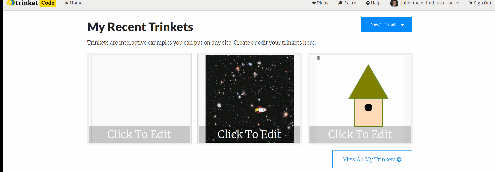
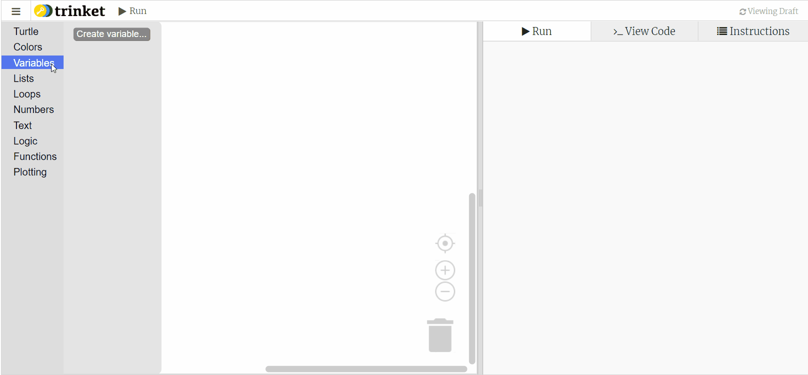
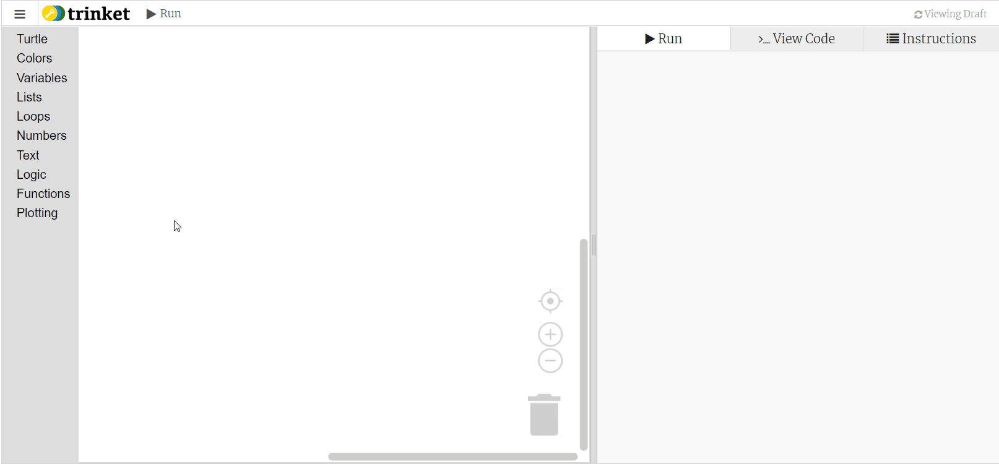
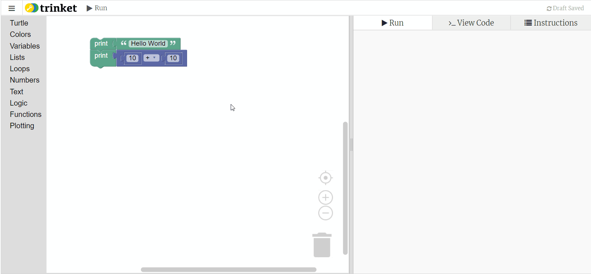
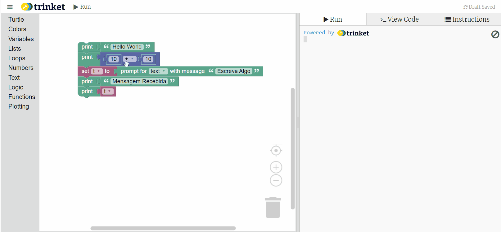
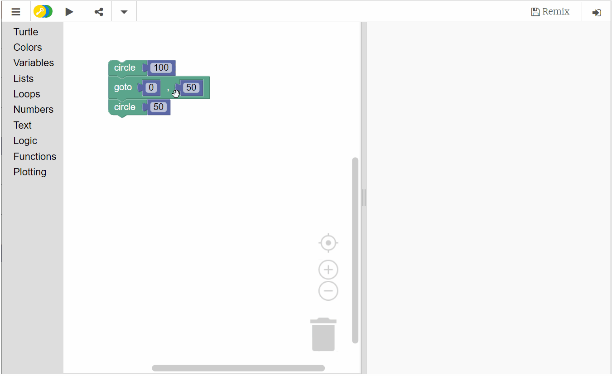

# Setup do Editor de Código em Blocos

## Criando um código com linguagem de blocos

Usar o editor de código em blocos do trinket não é difícil, siga os passos abaixo:

1. Entre no site [trinket](trinket.io) e crie uma conta grátis.
2. No seu home crie um novo trinket com o formato de blocos

No editor de código você tem opções como salvar, adicionar a algum diretório, deletar e compartilhar seu codigo via trinket.io. Para compartilhar uma versão do seu código, use o botão compartilhar e copie o link fornecido.

##  Elementos do Editor de Código

O editor de código tem alguns elementos principais, que são o _toolbox_, a _área de edição_ de código, a área do _terminal e plots_ e o _código em python_ gerado.

Para as aulas iniciais não estaremos interessados no código em python gerado, porém, fique à vontade para inspecionar o código se tiver curiosidade.

### Toobox ou caixa de ferramentas

Contém os blocos de código que usaremos nos nossos programas. Cada bloco está organizado em seções específicas dependendo de sua funcionalidade.

Neste caso foram mostrados os conjuntos:

* __logic__ : que contem blocos relacionados aos condicionais da lógica de programação
* __varialbles__ : que contem a funcionalidade para criar novas variáveis no código
* __text__ : que agrupa as funcionalidades relaciona das com variáveis e dados textuais
* __number__ : que agrupa as funcionalidades relacionadas com variáveis e dados numéricos

Outros conjuntos também estão disponíveis, porém não serão usados nas aulas iniciais.

### Área de edição de Código

Nesta área é possível editar o código em blocos arrasttando os blocos desejados do toolbox ou duplicando os blocos que já estiverem na área. É possível deletar blocos arrastando-os para dentro do toolbox ou usando a lixeira na parte inferior direita. Comandos básicos de cópia e deleção também são possíveis como nos editores de texto: ctrl + c/v, ctrl + z ou delete.

Ao clicar com o botão direito em cima de um bloco um conjunto de opções é mostrado:

* __duplicate__ : Duplica um bloco ou conjunto, em termos práticos faz o mesmo que ctrl + c/v
* __add comment__ : Permite que seja adicionado um comentário ao bloco, pode ser útil para explicar alguma parte do código
* __collapse/expand block__ : Collapse, faz com que o bloco fique em uma visualização reduzida, ocupando menos espaço. Expand volta à exibição normal.
* __disable/enable block__ : Disable desabilita um bloco, fazendo com que sua execução seja ignorada. Enable reabilita o bloco.
* __help__ : Exibe material de ajuda sobre como dado bloco funciona. Aconselho que peça ajuda aos professores neste caso.

### Área do Terminal/Plotting e Código em Python Gerado

A execução do código é feita na area do terminal/plot. Apenas ponha seus blocos na área de edição e clique no botão "Run"

1. Nesse caso temos duas possiblidades, na primeira estamos executando um código com saída puramente textual que pergunta informações ao usuário e exibe dados no terminal.

2. Neste outro caso temos uma saída de desenho usando gráficos do conjnto _turtle_;

É possível combinar a saída com gráficos e a saída textual. Apenas use blocos do conjunto _Turtle_ e os blocos de texto do conjunto _Text_. Você também pode verificar como ficou o código em pythom em qualquer um dos casos usando a aba de __View Code__ na área de do Terminal/Plotting.

### Usando códigos de Exemplo

É possível copiar códigos compartilhados do trinket de outra pessoa usando o botão "remix" que fica a parte superior de códigos compartilhados. Use o exemplo abaixo para copiar para sua pasta "My Trinkets" e edite usando sua conta do trinket.

Caso você já esteja logado no trinket, a opção de login não aparecerá. O botão remix permite que você edite o código inline ou resete o código para a versão original. Códigos remixados podem ser acessados no diretório "My trinkets" da sua conta do trinket.

Tente copiar o código abaixo e editá-lo para ter certeza e que tudo está funcionando:

<iframe src="https://trinket.io/embed/blocks/166fa117f0?hideGeneratedCode=true" width="100%" height="600" frameborder="0" marginwidth="0" marginheight="0" allowfullscreen></iframe>

